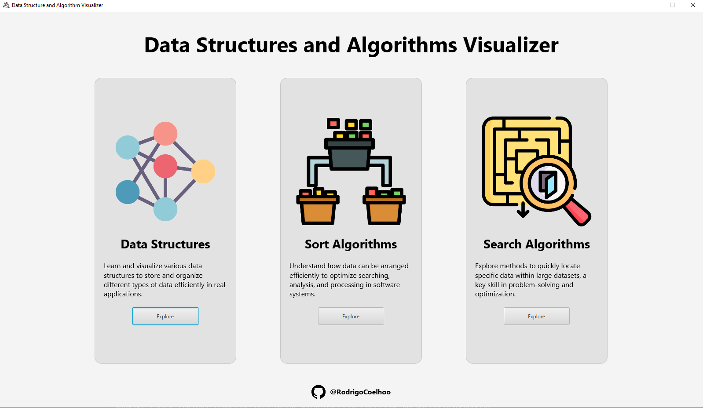
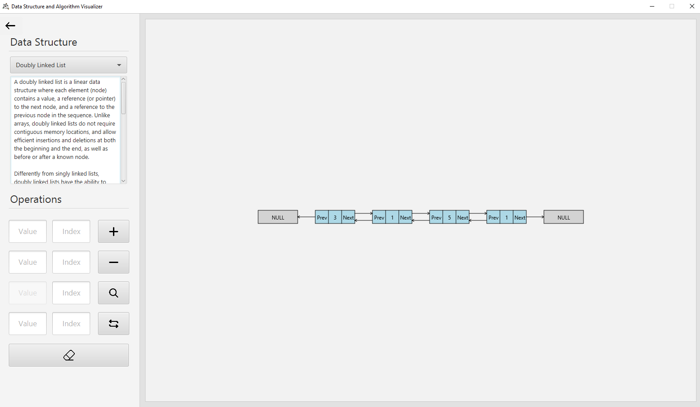
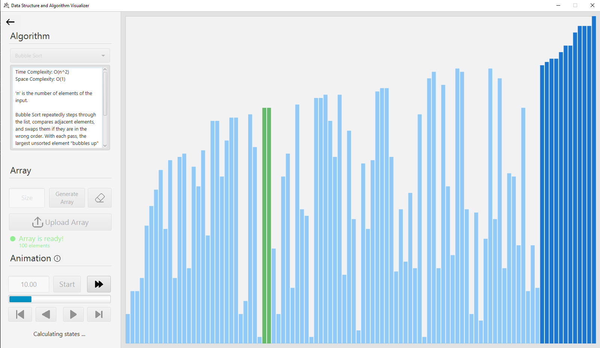
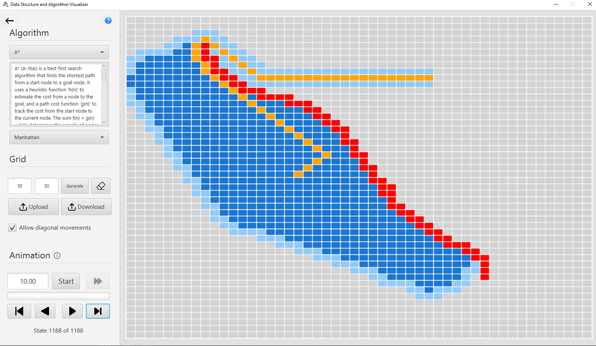

# 📊 Data Structures and Algorithms Visualizer

A JavaFX-based application for visualizing classic **sorting algorithms**, **search algorithms**, and **data structures**.

## 🚀 Features
- Step-by-step visualization of sorting and searching algorithms.
- Interactive animations for common data structures.
- Clean, intuitive JavaFX interface for learning and teaching.

## 🛠️ Technologies Used
- [JavaFX 24.0.1](https://openjfx.io/)
- JDK 24.0.2

## 📑 Implemented Data Structures & Algorithms 

### 🗂️ Data Structures
- Array
- Linked List
- Doubly Linked List
- Queue
- Priority Queue
- Stack
- Binary Search Tree
- Min Heap
- Max Heap

### 🔄 Sorting
- Bubble Sort
- Bucket Sort
- Insertion Sort
- Merge Sort
- Quick Sort
- Selection Sort

### 🔎 Searching
- A*
- Breadth-First Search (BFS)
- Best-First Search (Greedy)
- Jump Point Search

## 🧪 How to Run
1. Clone the repository:
```bash
https://github.com/RodrigoCoelhoo/Data-Structures-And-Algorithms.git
```
2. Open the project in your preferred IDE (VSCode, IntelliJ IDEA, Eclipse ...)
3. Ensure the main class is set to [src/gui/Main.java](src/gui/Main.java)
4. **Configure JavaFX**  
You have two options depending on whether you want to use a **system-installed JavaFX** or the **JavaFX libraries included in the project** (E.g: [launch.json](.vscode/launch.json)):  

**Option A: JavaFX installed outside the project**  
```bash
"vmArgs": "--module-path \"C:\\Program Files\\Java\\javafx\\lib\" --add-modules javafx.controls,javafx.fxml"
```

**Option B: JavaFX included in the project (lib/ and lib/native/)**
```bash
"vmArgs": "--module-path ${workspaceFolder}/lib --add-modules javafx.controls,javafx.fxml --enable-native-access=javafx.graphics -Djava.library.path=${workspaceFolder}/lib/native"
```

5. Run Main.java

## 🖼️ Screenshots

### 🏠 Main Menu


### 🗂️ Data Structures


### 🔄 Sorting Algorithms


### 🔎 Search Algorithms



## 📝 Notes
- **Performance:** The animations are not fully optimized, especially for sorting algorithms. Larger settings (e.g., longer arrays or faster animations) may consume significant system resources. Be sure to balance settings like **animation duration** and **array size** to avoid excessive memory usage, since every state of the algorithm is stored for visualization.

- **Data Structures:** After a large number of insertions, animations for some data structures may extend beyond the visible screen area.

- **Generics:** All sorting, searching, and data structure implementations were designed using **generics** and can be reused with minor modifications (by removing lines related to "Save state").

- **Code Quality:** The objective was to keep the code as clean and readable as possible. However, some parts may contain "spaghetti code" due to changes made during mid-project development.


## 📚 Sources
- https://www.flaticon.com/